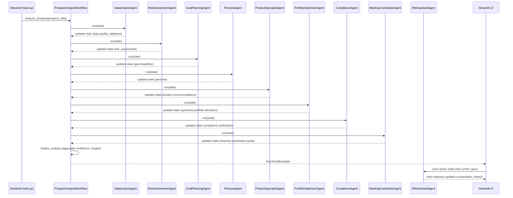

# RM-AgenticAI-LangGraph — Architecture Explanation

This document gives a focused, developer-oriented explanation of the system architecture, the runtime workflow, data shapes, component responsibilities, error modes, persistence boundaries, and recommended extension points.

## Purpose

Provide a single-source, slightly deeper view of how the pieces in `Project/` interact so a developer can safely add agents, nodes, persistence, or swap LLMs.

## High-level components

- UI: `main.py` — Streamlit interface to trigger analysis, show results, and run chat via the RM Assistant.
- Orchestrator: `graph.py` — builds a LangGraph `StateGraph` (entry node: `data_analysis`) with async node handlers for each agent step. A lightweight fallback orchestration is in `workflow/workflow.py` for experimentation.
- Agents: `langraph_agents/agents/*` — each agent encapsulates a discrete domain task and implements the `BaseAgent` contract. Agents are async and return an updated `WorkflowState`.
- Agent base: `langraph_agents/base_agent.py` — provides `run(state)` wrapper, `execute(state)` abstract method, monitoring and error handling patterns (Critical vs Optional agents).
- State models: `state.py` — Pydantic models used by workflow and UI. Agent-facing models also exist under `langraph_agents/state_models.py`.
- Nodes: `nodes/` — helpers that call agents and perform node-level logging and state updates (example: `data_analysis_node.py`).
- Checkpoint/persistence: `langgraph.checkpoint.memory.MemorySaver` is used by default in `graph.py` (in-memory). This is pluggable.
- Config & logging: `config/` — centralized settings (LLM keys, thresholds) and logging setup used across agents and workflow.

## Sequence (text + Mermaid)

Linear execution order used by the main workflow:

1. data_analysis (DataAnalystAgent)
2. risk_assessment (RiskAssessmentAgent)
3. goal_planning (GoalPlanningAgent)
4. persona_classification (PersonaAgent)
5. product_recommendation (ProductSpecialistAgent)
6. portfolio_optimization (PortfolioOptimizerAgent)
7. compliance_check (ComplianceAgent)
8. meeting_coordination (MeetingCoordinatorAgent)
9. finalize_analysis (internal aggregator)

Mermaid sequence diagram (paste into a renderer or GitHub that supports Mermaid):

## Data flows & contracts

- Input contract: `ProspectData` (Pydantic) — must include `prospect_id`, `name`, `age`, `annual_income`, `current_savings`, `target_goal_amount`, `investment_horizon_years`, `number_of_dependents`, `investment_experience_level` (others optional). Use these fields as the canonical truth across agents.
- Output contract: `WorkflowState` — contains `prospect`, `analysis`, `recommendations`, `meeting`, `chat`, `agent_executions`, `completed_steps`, `failed_steps`, `overall_confidence`, `key_insights`, `action_items`.
- Agent contract: implement `async def execute(self, state: WorkflowState) -> WorkflowState`. Use `BaseAgent.run(state)` in the orchestrator so validation, logging, and metrics are applied.

Example: Risk agent must read `state.prospect.prospect_data` (cleaned by data analysis) and write `state.analysis.risk_assessment` containing a `risk_level` and `confidence_score`.

## Component responsibilities (short)

- `main.py`: UX, selecting prospects, showing progress, and displaying the final `WorkflowState`. It only triggers the workflow and renders outputs.
- `graph.py`: builds `StateGraph`, registers nodes, composes edges, configures checkpointer, and contains finalization logic `_finalize_analysis_node` that calculates `overall_confidence`, `key_insights`, and `action_items`.
- Agents: encapsulate domain logic with explicit success/failure behavior. Prefer `CriticalAgent` when the result is required for downstream correctness (e.g., `data_analysis`, `risk_assessment`) and `OptionalAgent` when graceful degradation is acceptable (e.g., `persona_classification`).
- `state.py`: authoritative schema. Use Pydantic for validation and serialization when checkpointing or returning results to UI.

## Error handling modes

- Critical failure: agent is implemented as `CriticalAgent` -> failure raises and halts the workflow. The orchestrator records the failure in `state.agent_executions` and `state.failed_steps`.
- Optional failure: `OptionalAgent` logs and returns an unchanged or partially updated state; workflow continues.
- Finalization: `_finalize_analysis_node` guards against missing sub-results and uses sensible defaults (e.g., averaging available confidence scores).

## Persistence & durability

- Default: `MemorySaver()` — ephemeral, good for local dev, not for concurrent or long-running jobs.
- For durability: implement or configure a LangGraph-supported saver that persists `WorkflowState` to file, a database, or Redis. That checkpointer will accept/return the `WorkflowState` payload between nodes and across process restarts.

## Performance & scalability considerations

- Agents are async. Heavy LLM calls are the primary latency source — consider batching or streaming where supported by LLM provider.
- For parallelizable steps, consider splitting StateGraph into branches (LangGraph supports branching) so independent nodes can run concurrently.
- Use a durable checkpointer to allow workload distribution across workers.

## Extension points (concrete)

1. Add an agent
   - Create `Project/langraph_agents/agents/my_agent.py` and subclass `BaseAgent`.
   - Implement `async def execute(self, state: WorkflowState) -> WorkflowState`.
   - Add to `graph.py`: instantiate agent in `__init__`, add a node, and connect edges in `_build_workflow()`.

2. Add persistence
   - Replace `MemorySaver()` in `graph.py` with a file or DB checkpointer.
   - Ensure serialized `WorkflowState` is compatible (Pydantic `.dict()` / `.json()` is a good pattern).

3. Swap LLM provider
   - Wire new LLM client in `config/settings.py` and pass the client instance into agents during construction.

4. Add observability
   - Extend `BaseAgent` to emit metrics (Prometheus counters/histograms) and add structured logs including session_id and node name.

## Deployment notes

- Local dev: use the provided Streamlit app. Run inside `Project/` with a virtualenv. See `Project/README.md` for commands.
- Production: run the orchestrator in an async-capable runner (uvicorn with an API that triggers `analyze_prospect`, or a job worker). Ensure a durable checkpointer is used and that LLM keys and rate limits are managed.

## Validation & testing recommendations

- Unit tests: create tests for each agent verifying expected mutation to `WorkflowState` given controlled inputs (mock LLM calls where applicable).
- Integration: a small end-to-end test that runs `ProspectAnalysisWorkflow.analyze_prospect` on a known prospect fixture and asserts presence of `overall_confidence`, `key_insights`, and `recommended_products`.

## Quick checklist for adding a new feature

1. Add Pydantic models for any new fields in `state.py`.
2. Implement agent with `execute` and local unit tests.
3. Register agent in `graph.py` and add tests covering the new node ordering and finalization.
4. Add logs and, if necessary, metrics.
5. Run full test suite and smoke test via Streamlit UI if needed.

## File location

`Project/explain_architecture.md` — this file.

---

If you want I can now:
- add a rendered Mermaid block to `Project/README.md`, or
- add a small end-to-end integration test file under `Project/tests/` that runs `ProspectAnalysisWorkflow.analyze_prospect` with a fixed input (mocking any LLMs), or
- swap the `MemorySaver()` checkpointer with a simple file-backed saver and add an example run snippet.

Tell me which of those you'd like me to do next.
