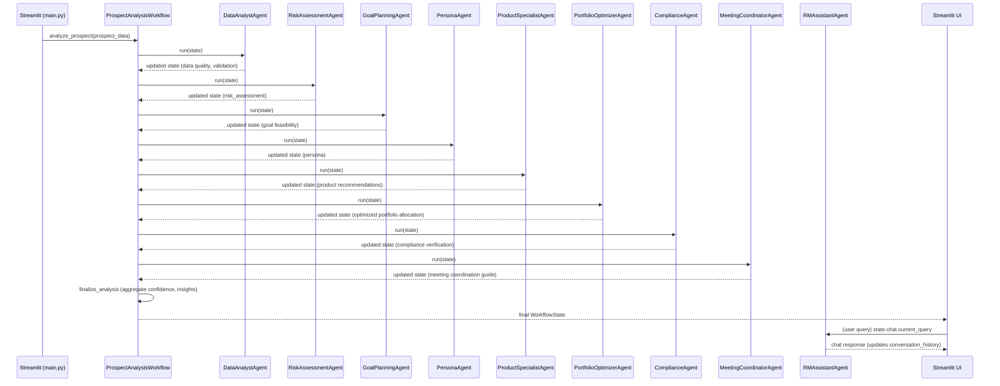

# Relationship Manager (RM) Agentic AI System

An advanced, multi-agent financial advisory platform built on **LangGraph**, **Streamlit**, and **Scikit-Learn**. The system automates comprehensive financial prospect analysis, investor persona classification, portfolio allocation, suitability/compliance verification, and client meeting coordination to help relationship managers prepare high-quality wealth recommendations.

---

## Table of Contents
- [System Overview](#system-overview)
- [Key Features](#key-features)
- [Architecture & Workflow](#architecture--workflow)
  - [Node Execution Sequence](#node-execution-sequence)
  - [Workflow Orchestration Graph](#workflow-orchestration-graph)
- [Directory Layout](#directory-layout)
- [Installation & Quick Start](#installation--quick-start)
  - [1. Prerequisites](#1-prerequisites)
  - [2. Clone & Setup Virtual Environment](#2-clone--setup-virtual-environment)
  - [3. Install Dependencies](#3-install-dependencies)
  - [4. Environment Configuration](#4-environment-configuration)
  - [5. Run the Streamlit Dashboard](#5-run-the-streamlit-dashboard)
- [Machine Learning & Model Training](#machine-learning--model-training)
- [Test Suite & Verification](#test-suite--verification)
- [State Management & Data Schema](#state-management--data-schema)
- [Resilience & Error Handling](#resilience--error-handling)
- [Extension Points](#extension-points)

---

## System Overview

Wealth management requires analyzing diverse, unstructured, and structured data under strict regulatory constraints. The RM Agentic AI System automates this process through a structured multi-agent pipeline:

```
[Prospect Raw Data] ──> [Data Analyst Agent] ──> [Risk & Goal Models] ──> [Persona Classifier] 
                         │                                              │
[Meeting Guide & PDF] <── [Compliance Checks] <── [Portfolio Allocator] <── [Product Specialist]
```

By dividing the workflow into discrete agent nodes, the system ensures deterministic data checks, robust machine learning predictions (for risk and goal success), domain-specific agent reasoning, and auditability at every step.

---

## Key Features

1. **Sequential Multi-Agent Orchestration**: Powered by **LangGraph**, coordinating 8 specialized agents and a finalization node with state tracking.
2. **Predictive Machine Learning**: Built-in scikit-learn random forest models that predict investor risk profiles and evaluate financial goal feasibility.
3. **Smart Investment Matchmaker**: Dynamically scores and ranks financial products (equity, mutual funds, debt, fixed deposits) using client profiles.
4. **Automated Suitability & Compliance Checks**: Ensures recommended products align with the client's risk profile and checks for regulatory violations.
5. **Relationship Manager Client Guide**: Generates custom discovery questions, proposed meeting agendas, next-step action plans, and client objection-handling guides.
6. **Interactive AI Advisor Chatbot**: An embedded assistant (`RMAssistantAgent`) powered by Google's Gemini models, allowing RMs to query analysis states in real-time.
7. **Premium Streamlit UI**: A clean, modern slate-and-indigo dashboard featuring glassmorphic components, responsive grid layouts, interactive data tables, and dynamic Plotly indicators.

---

## Architecture & Workflow

### Node Execution Sequence

The prospect analysis follows a linear workflow of 9 nodes:



### Workflow Orchestration Graph

1. **`data_analysis`**: Parses raw data, checks for missing inputs, and assigns a data quality score. *(Critical Node)*
2. **`risk_assessment`**: Evaluates historical financial parameters via a trained machine learning model to classify the investor's risk tier (Low, Moderate, High). *(Critical Node)*
3. **`goal_planning`**: Assesses goal timeline feasibility, highlighting challenges and enabling success factors. *(Optional Node)*
4. **`persona_classification`**: Classifies behavior types (e.g., Aggressive Growth, Steady Saver, Cautious Planner) to tailor client communication. *(Optional Node)*
5. **`product_recommendation`**: Filters available mutual funds and fixed deposits to recommend the top candidates. *(Critical Node)*
6. **`portfolio_optimization`**: Calculates the weight distribution across recommended assets to align with risk targets. *(Optional Node)*
7. **`compliance_check`**: Runs suitability checks, identifies violations, and generates mandatory regulatory disclosures. *(Critical Node)*
8. **`meeting_coordination`**: Synthesizes analysis outputs into a relationship manager guide. *(Optional Node)*
9. **`finalize_analysis`**: Calculates the overall analysis confidence, generates key insights, and lists action items.

---

## Directory Layout

```
.
├── Project                      # Primary Application Code
│   ├── config                  # System Configuration
│   │   ├── logging_config.py   # Loguru logging setups
│   │   ├── settings.py         # Pydantic BaseSettings loading .env
│   │   └── utils.py            # Gemini model initializer utilities
│   ├── data                    # Product and Prospect Datasets
│   │   └── input_data          
│   │       ├── products.csv    # Available financial products catalog
│   │       └── prospects.csv   # Pre-configured test prospects list
│   ├── explain_architecture.md # Technical breakdown for developers
│   ├── graph.py                # LangGraph orchestration graph definition
│   ├── langraph_agents         # Multi-Agent Framework
│   │   ├── agents              # Specialized Agent Implementations
│   │   │   ├── compliance_agent.py
│   │   │   ├── data_analyst_agent.py
│   │   │   ├── goal_planning_agent.py
│   │   │   ├── meeting_coordinator_agent.py
│   │   │   ├── persona_agent.py
│   │   │   ├── portfolio_optimizer_agent.py
│   │   │   ├── product_specialist_agent.py
│   │   │   ├── risk_assessment_agent.py
│   │   │   └── rm_assistant_agent.py
│   │   ├── base_agent.py       # Core base classes (Critical vs Optional)
│   │   ├── state_models.py     # Pydantic states used inside agents
│   │   ├── tools               # LLM and Math Helper Tools
│   │   │   ├── calculation_tool.py
│   │   │   ├── csv_loader_tool.py
│   │   │   ├── data_processing_tool.py
│   │   │   ├── genai_tool.py
│   │   │   └── ml_prediction_tool.py
│   │   └── workflows
│   ├── main.py                 # Streamlit frontend user interface
│   ├── ml                      # Machine learning training & prediction
│   │   ├── models              # Serialized training model files (.pkl)
│   │   └── training            # ML model training scripts
│   │       ├── predict_goal_success.py
│   │       ├── predict_risk_profile.py
│   │       └── train_models.py # Trains Random Forest classifiers
│   ├── requirements.txt        # Python dependency packages list
│   ├── state.py                # Global Workflow State schema (Pydantic)
│   ├── tests.py                # Comprehensive system test suite
│   └── workflow                
│       └── workflow.py         # Legacy fallback sequential orchestrator
├── ml
│   └── models                  # Workspace root mirrored model artifacts folder
└── README.md                   # This project manual
```

---

## Installation & Quick Start

### 1. Prerequisites
- Python 3.9, 3.10, or 3.11 installed
- A Google Gemini API Key

### 2. Clone & Setup Virtual Environment
Run the following commands in your terminal:
```bash
# Set up a python virtual environment
python3 -m venv venv
source venv/bin/activate
```

### 3. Install Dependencies
Install all required libraries using the provided requirements file:
```bash
pip install -r Project/requirements.txt
```

### 4. Environment Configuration
Create a `.env` file inside the `Project/` folder (or copy from a template):
```bash
# Create and edit .env file
cp Project/.env.example Project/.env
```
Ensure the `.env` contains your Google Gemini API Key:
```env
GEMINI_API_KEY_1=your_google_gemini_api_key_here
LOG_LEVEL=INFO
ENABLE_MONITORING=true
```

### 5. Run the Streamlit Dashboard
Launch the interface with the following command:
```bash
cd Project
streamlit run main.py
```
Open [http://localhost:8501](http://localhost:8501) in your browser.

---

## Machine Learning & Model Training

The system utilizes two random forest classifiers for automated predictions. 

- **Risk Profile Classifier**: Classifies clients as `Low`, `Moderate`, or `High` risk based on age, income, dependents, horizon, and experience.
- **Goal Feasibility Predictor**: Evaluates if the goal is `Likely` or `Unlikely` to succeed based on savings ratio and horizon.

The models are pre-trained. If you want to re-train the models on new data, run:
```bash
python Project/ml/training/train_models.py
```
This script generates synthetic training data, trains the models, and outputs the serialized `.pkl` and encoder files to both `Project/ml/models/` and `ml/models/`.

---

## Test Suite & Verification

The project includes a comprehensive, unified test file (`Project/tests.py`) that checks settings, imports, model loaded states, predictions, agent class instantiations, and E2E workflow cycles.

Run the test suite using Python:
```bash
python Project/tests.py
```

Or run via pytest:
```bash
pytest Project/tests.py
```

The output verifies environment setup, model loads, classification predictions, and system integration.

---

## State Management & Data Schema

The workflow uses Pydantic for validation and serialization. The state contract is defined in `Project/state.py` under the `WorkflowState` class:

- **`prospect`**: Raw data, missing fields, validation errors, and data quality scores.
- **`analysis`**: Risk assessment results, goal predictions, and investor personas.
- **`recommendations`**: List of recommended products, allocation weights, and compliance check flags.
- **`meeting`**: Meeting agenda items, key talking points, and objection-handling strategies.
- **`chat`**: Thread ID, current query, context dictionary, and conversation history.
- **`execution`**: Steps completed/failed, execution time metrics, and active node status.

---

## Resilience & Error Handling

- **Critical Agents**: Inherit from `CriticalAgent`. If a critical node (e.g., `Data Analyst`, `Risk Assessor`, `Product Specialist`, or `Compliance`) encounters an unhandled exception, it immediately stops graph execution to prevent bad recommendations.
- **Optional Agents**: Inherit from `OptionalAgent`. If an optional node fails (e.g., `Goal Planner`, `Persona Classifier`, or `Meeting Coordinator`), it logs the failure, leaves the state variables untouched, and allows the remaining nodes in the graph to execute.
- **Durable Checkpointing**: Evaluated in `graph.py` using LangGraph's `MemorySaver()`, which persists intermediate state steps on a thread level, facilitating easy rollbacks or step-by-step inspections.

---

## Extension Points

1. **Add a New Agent**:
   - Create a subclass of `BaseAgent` (or `CriticalAgent` / `OptionalAgent`) in `Project/langraph_agents/agents/`.
   - Implement `async def execute(self, state: WorkflowState) -> WorkflowState`.
   - Register it in `Project/graph.py` inside `__init__` and map it to a new node in `_build_workflow()`.

2. **Add a Checkpointing Database**:
   - Swap the default in-memory `MemorySaver()` checkpointer in `Project/graph.py` with an external saver (e.g., PostgreSQL or Redis checkpointer).

3. **Swap LLM Providers**:
   - Edit the provider clients inside `Project/config/settings.py` and pass the new model wrapper (e.g., OpenAI or Anthropic) to the agents.
